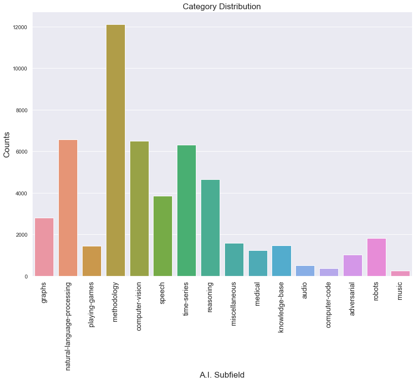

# About Data
Dataset is crawled from [Paperswithcode database](https://paperswithcode.com/sota) with help of their [API](). There were 52,527 papers with their abstract, title and other meta-data. There are 16 areas in total and they are the followings - adversarial, audio, computer-code, computer-vision, graphs,knowledge-base, medical, methodology, miscellaneous, music, natural-language-processing, playing-games, reasoning, robots, speech and time-series. Papers were pre-processed in order to correspond to one single area

Distribution is as follows

